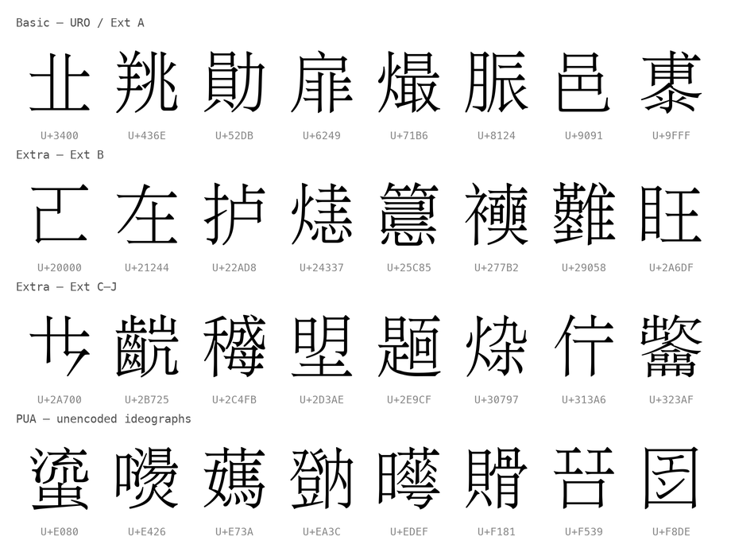

# BabelStone Han Webfonts ／ BabelStone Han 網頁字型

[繁體中文](#繁體中文) · [English](#english)



（第 1 行：Basic — URO 與 Ext A；第 2–3 行：Extra — Ext B 與 Ext C–J；第 4 行：PUA。
Row 1: Basic — URO and Ext A; rows 2–3: Extra — Ext B and Ext C–J; row 4: PUA.）

---

## 繁體中文

BabelStone Han 三款字型的 256 碼位切片 woff2 網頁字型，生成自
[babelstone/babelstonehan-ufo](https://github.com/babelstone/babelstonehan-ufo)
（[BabelStone Fonts](https://www.babelstone.co.uk/Fonts/) 的 UFO 源碼倉庫）：

| 字族 | 覆蓋範圍 | 上游版本 |
|------|----------|----------|
| `BabelStone Han Basic` | 基本平面：URO（U+4E00–9FFF）、Ext A、相容表意文字、標點——33,810 碼位 | 18.0.1（tag `v18.0.1`） |
| `BabelStone Han Extra` | 增補平面：Ext B–J（U+20000–U+3347F）、相容表意文字補充——37,010 碼位 | 18.0.1（tag `v18.0.1`） |
| `BabelStone Han PUA` | BMP 私用區（U+E080–U+F8DE）：5,000 多個未編碼或暫定漢字——配合 IDS 資料使用 | 1.484（tag `PUAv1.484`） |

三者合計覆蓋約 76,000 碼位。將三個字族依序疊入 font stack，瀏覽器只會下載
頁面實際用到的 256 碼位分片：

### 使用方式

```html
<link rel="stylesheet" href="./babelstone-han.css">
```

發布到 npm 後建議從 jsDelivr 載入（本包僅約 19 MB，遠低於 jsDelivr 150 MB
的整包上限，可正常服務）：

```html
<link rel="stylesheet" href="https://cdn.jsdelivr.net/npm/@free-fonts/babelstone-han@1.1.0/babelstone-han.css">
```

unpkg 等效：

```html
<link rel="stylesheet" href="https://unpkg.com/@free-fonts/babelstone-han@1.1.0/babelstone-han.css">
```

```css
body {
  font-family: 'BabelStone Han Basic', 'BabelStone Han Extra',
    'BabelStone Han PUA', serif;
}
```

CSS 以 256 碼位為一片的 `unicode-range` 切片（與 `jigmo-webfonts` 等 CJK
網頁字型專案相同的慣例），沒有生僻字的頁面下載零位元組。

### OpenType 特性

Basic 的分片保留上游 GSUB/GPOS 表（`calt`、`liga`、`vert` 直排替換）與
表意文字異體字序列（IVS，cmap format 14）；每個分片都帶有字型的異體字
選擇符，base+VS 組合可正常顯示。Extra 分片同樣保留 IVS。PUA 上游本身
無 layout 表。

Basic 另有 110 個基底字只能經異體字序列取用（多為相容表意文字 U+2F800–2FA1D
正規化後的標準化變體，如 U+2F803 → `U+20122 U+FE00`），基底字本身不在 Basic
的 cmap 裡。這 112 組序列打包在 `BabelStoneHanBasic-svs.woff2`，其
`unicode-range` 只列這 110 個碼位；單獨出現的基底字仍會落到 Extra。

- 線上樣張：<https://free-fonts.digitalhumanities.dev/specimen?font=babelstone-han>
- 上游：<https://github.com/babelstone/babelstonehan-ufo>（<https://www.babelstone.co.uk/Fonts/> 的 UFO 源碼）
- 上游字型授權：Arphic Public License（文鼎公眾授權）
- 本包腳本與詮釋資料授權：MIT
- 生成的 woff2 檔案：485 個（484 個 256 碼位 `unicode-range` 分片＋1 個 SVS 分片）
- IVS 測試頁：<https://free-fonts-npm.github.io/BabelStoneHan-UFO-Fonts/BSH_IVS.html>（上游 IVS 對照表，經 jsDelivr 載入本包 1.1.0 字型；原始檔 [`BSH_IVS.html`](BSH_IVS.html) 僅在 repo）
- 版本紀錄：[CHANGELOG.md](CHANGELOG.md)
- 從上游重建：`pip install fonttools brotli && python3 build.py`

### 修改聲明（Arphic Public License §2a）

本包 `fonts/*.woff2` 生成自上游 `BabelStoneHanBasic.ttf`／
`BabelStoneHanExtra.ttf`（tag `v18.0.1`）與 `BabelStoneHanPUA.ttf`
（tag `PUAv1.484`），以 fontTools 切為 256 碼位分片並轉換為 WOFF2。
字形輪廓未經修改。

完整的 PUA 字形對照表（含 IDS 資料）以 `PUA.html`／`IDS_PUA.TXT` 隨每次
[上游 release](https://github.com/babelstone/babelstonehan-ufo/releases) 發布。

---

## English

Chunked woff2 webfonts for the three BabelStone Han fonts, generated from
[babelstone/babelstonehan-ufo](https://github.com/babelstone/babelstonehan-ufo)
(the UFO source repository for
[BabelStone Fonts](https://www.babelstone.co.uk/Fonts/)):

| Family | Coverage | Upstream version |
|--------|----------|------------------|
| `BabelStone Han Basic` | BMP: URO (U+4E00–9FFF), Ext A, compatibility ideographs, punctuation — 33,810 codepoints | 18.0.1 (tag `v18.0.1`) |
| `BabelStone Han Extra` | Supplementary planes: Ext B–J (U+20000–U+3347F), compat supplement — 37,010 codepoints | 18.0.1 (tag `v18.0.1`) |
| `BabelStone Han PUA` | BMP Private Use Area (U+E080–U+F8DE): 5,000+ unencoded or provisional ideographs — companion to the IDS data | 1.484 (tag `PUAv1.484`) |

Together they cover ~76,000 codepoints. Stack all three families and browsers
download only the 256-codepoint slices actually used on the page:

### Usage

```html
<link rel="stylesheet" href="./babelstone-han.css">
```

Once published to npm, loading from jsDelivr is recommended (at ~19 MB the
package is well under jsDelivr's 150 MB whole-package limit):

```html
<link rel="stylesheet" href="https://cdn.jsdelivr.net/npm/@free-fonts/babelstone-han@1.1.0/babelstone-han.css">
```

unpkg equivalent:

```html
<link rel="stylesheet" href="https://unpkg.com/@free-fonts/babelstone-han@1.1.0/babelstone-han.css">
```

```css
body {
  font-family: 'BabelStone Han Basic', 'BabelStone Han Extra',
    'BabelStone Han PUA', serif;
}
```

The CSS uses 256-codepoint `unicode-range` chunks (the same convention used by
CJK webfont projects like `jigmo-webfonts`), so pages containing no rare
characters download zero bytes.

### OpenType features

The Basic slices keep the upstream GSUB/GPOS tables (`calt`, `liga`, `vert`)
and Ideographic Variation Sequences (cmap format 14); every slice carries the
font's variation selectors so base+VS pairs render correctly. Extra slices
keep IVS as well. PUA has no layout tables upstream.

Basic also has 110 base characters reachable only through a variation sequence
(mostly the standardized variants of compatibility ideographs
U+2F800–2FA1D after normalization, e.g. U+2F803 → `U+20122 U+FE00`); the bases
themselves are not in Basic's cmap. These 112 sequences live in
`BabelStoneHanBasic-svs.woff2`, whose `unicode-range` lists just those 110
codepoints; a bare base without a selector still falls through to Extra.

- Live specimen: <https://free-fonts.digitalhumanities.dev/specimen?font=babelstone-han>
- Upstream: <https://github.com/babelstone/babelstonehan-ufo>
  (UFO sources for <https://www.babelstone.co.uk/Fonts/>)
- Upstream font license: Arphic Public License
- Package scripts and metadata license: MIT
- Generated woff2 files: 485 (484 256-codepoint `unicode-range` chunks + 1 SVS chunk)
- IVS test page: <https://free-fonts-npm.github.io/BabelStoneHan-UFO-Fonts/BSH_IVS.html> (upstream IVS chart loading 1.1.0 of these webfonts from jsDelivr; source [`BSH_IVS.html`](BSH_IVS.html), repo only)
- Changelog: [CHANGELOG.md](CHANGELOG.md)
- Rebuild from upstream: `pip install fonttools brotli && python3 build.py`

### Modification notice (Arphic Public License §2a)

The `fonts/*.woff2` files in this package were generated from the upstream
`BabelStoneHanBasic.ttf` / `BabelStoneHanExtra.ttf` (tag `v18.0.1`)
and `BabelStoneHanPUA.ttf` (tag `PUAv1.484`) by subsetting into 256-codepoint
slices and converting to WOFF2 with fontTools. Glyph outlines are unmodified.

The full PUA glyph chart with IDS data is published as `PUA.html` /
`IDS_PUA.TXT` in each
[upstream release](https://github.com/babelstone/babelstonehan-ufo/releases).
